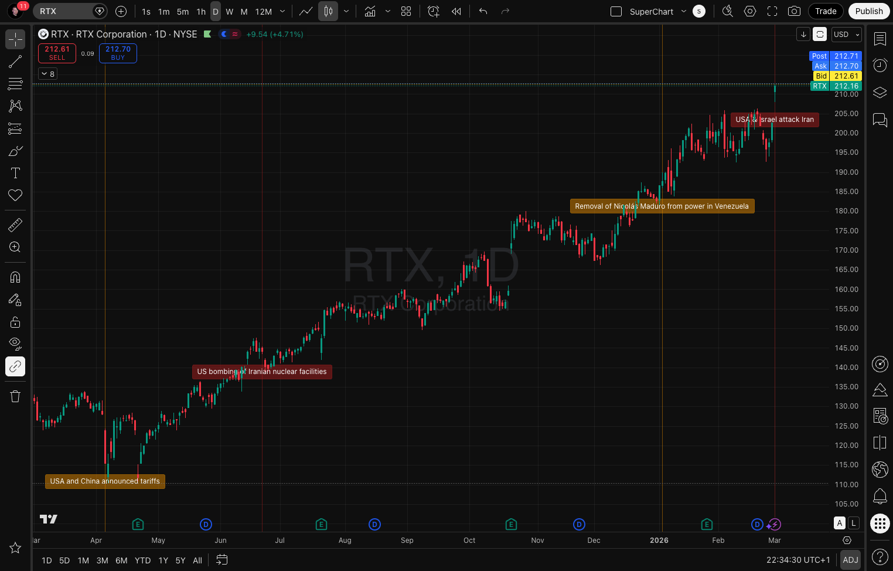

# 🌍 Worldwide Events — TradingView Indicator

An indicator that overlays key historical events directly on the price chart — from 1940 to the present day.



## Features

- 📅 Historical events — from World War II to modern crises and conflicts
- 📈 Plotted directly on the chart — see how the market reacted to each event
- 🎨 Color-coded categories — 🔴 High priority / 🟠 Medium priority / 🟡 Low priority
- 🔍 Date tooltip — hover over an event to see its date without cluttering the chart
- ⚙️ One-click filters — show only the categories you care about
- 🕰️ History going back to 1940 — Pearl Harbor, Black Monday, Lehman Brothers
- 💥 Financial crises — FTX, SVB, COVID crash, 2008 crisis
- 🌐 Geopolitics — wars, attacks, sanctions, oil embargoes
- 🏦 Monetary policy — every pivotal Fed and ECB decision on the timeline
- 🔄 Continuously updated — Liberation Day 2025, US-China tariffs, Iran
- ⚡ Zero configuration — works immediately after adding to the chart
- 🆓 Open source — full code available and modifiable

## Supported Languages

Event descriptions are available in the following languages:

| Code  | Language |
| ----- | -------- |
| 🇬🇧 EN | English  |
| 🇵🇱 PL | Polish   |

To add a new language, create `data/events-XX.md` (where `XX` is the language code) using the same table format as the existing files. The indicator and GitHub Actions workflow will pick it up automatically.

## Installation

1. 📈 Open a chart on [TradingView](https://www.tradingview.com/chart/)
2. 🧩 Click **"📊 Indicators"**
3. 🔎 Search for `"Worldwide Events"` and add it to the chart
4. ⚙️ Adjust settings to your preferences
5. 🌐 Select the language in the Settings panel
6. 🗂️ Choose the event categories you want to see
7. 🗓️ Hover over an event icon to see its date
8. 📊 Analyze market reactions to key historical moments

## Development

Events are stored in `data/events-EN.md` and `data/events-PL.md`. The Pine Script file is generated automatically — do not edit it by hand.

To regenerate `worldwide-events.pine` after modifying event data:

```bash
python scripts/generate-events.py
```

To add a new language, create `data/events-XX.md` (where `XX` is the ISO language code) using the same table format as the existing files. The generator and GitHub Actions workflow will pick it up automatically.

## Contributing

The indicator is open source — contributions, ideas, and modifications are very welcome. Together we can build a tool that helps investors better understand the market and make more informed decisions.

## Contact

Questions, suggestions, or want to share your ideas?

- 🐛 [Open an issue](https://github.com/piecioshka/tradingview-worldwide-events/issues)
